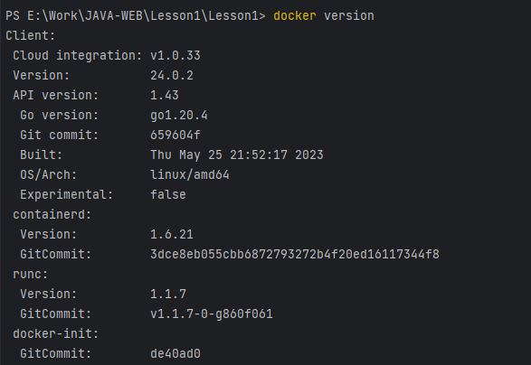
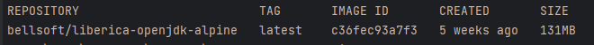
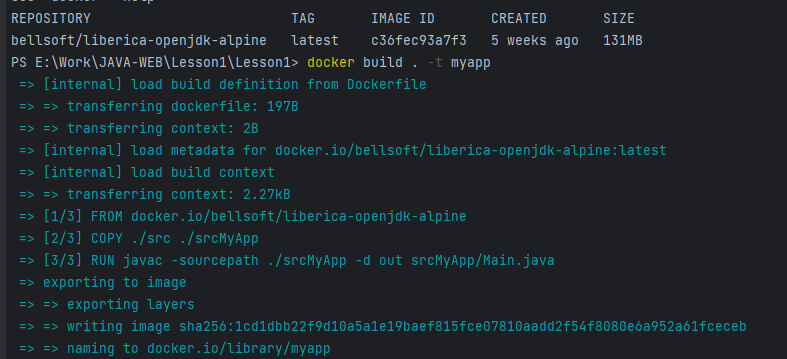
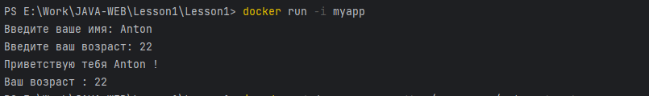
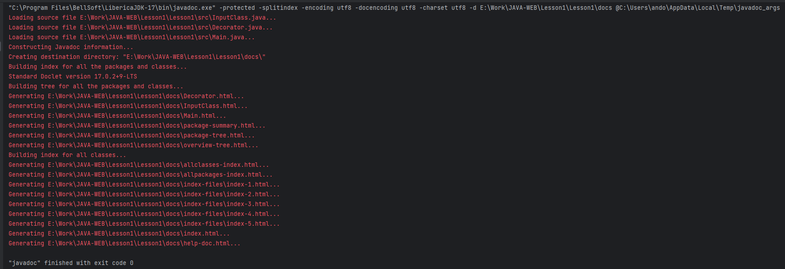
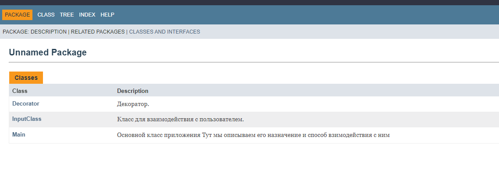

# Дошняя работа
## к семинару Урок 1. Компиляция и интерпретация кода

## Задание

Создать docker-контейнер для формирования полной документации по проекту
(Создание документации к проекту)

Проверяем наличие docker в терминале

    docker version

Скачаем образ Liberica OpenJDK 17

    docker pull bellsoft/liberica-openjdk-alpine:latest

проверим его среди образов

    docker images

Создадим Dockerfile и внесем в него строки:

    FROM bellsoft/liberica-openjdk-alpine

    COPY ./src ./srcMyApp

    RUN javac -sourcepath ./srcMyApp -d out srcMyApp/Main.java

    CMD java -classpath ./out Main

Соберем контейнер

    docker build . -t myapp

Запустим контейнер и поработаем в нашей программе в контейнере

    docker run -i myapp

Все ок

Внесем комментарии в стиле javadoc в исходники и сгенерируем веб-станицу с документацией к проекту

    javadoc.exe" -protected -splitindex -encoding utf8 -docencoding utf8 -charset utf8 -d E:\Work\JAVA-WEB\Lesson1\Lesson1\docs @C:\Users\ando\AppData\Local\Temp\javadoc_args

Открываем документацию в браузере

